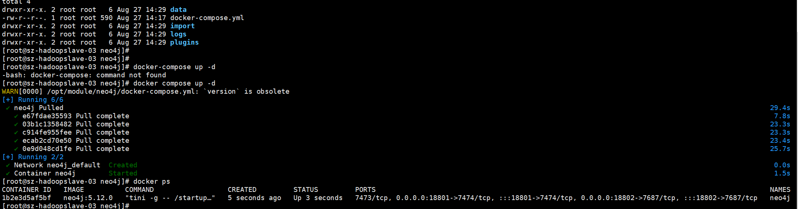
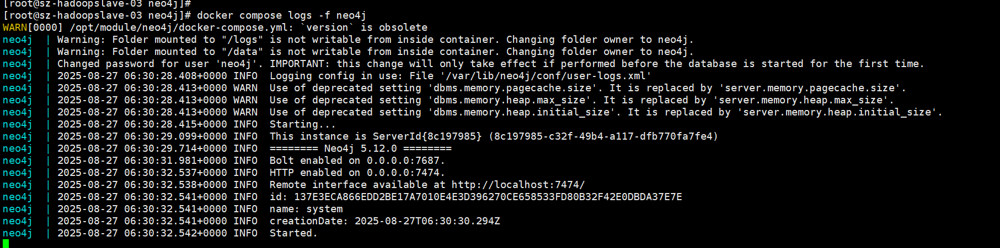

# Neo4j安装部署整理

---


## 基于Docker安装
- [docker compose安装]()
```.text
# 创建数据、日志、导入、插件目录
mkdir -p /opt/module/neo4j/{data,logs,import,plugins}
```
- [docker-compose.yml](docs/docker-compose.yml)
```.text
docker-compose up -d 或者 docker compose up -d 
docker-compose logs -f  # 查看日志，出现 Started. 表示启动完成
```
 </br>
 </br>


## 参考资料
- [Docker pull拉取镜像报错“Error response from daemon: Get "https://registry-1.docker.io/v2”解决办法](https://developer.aliyun.com/article/1281459)


