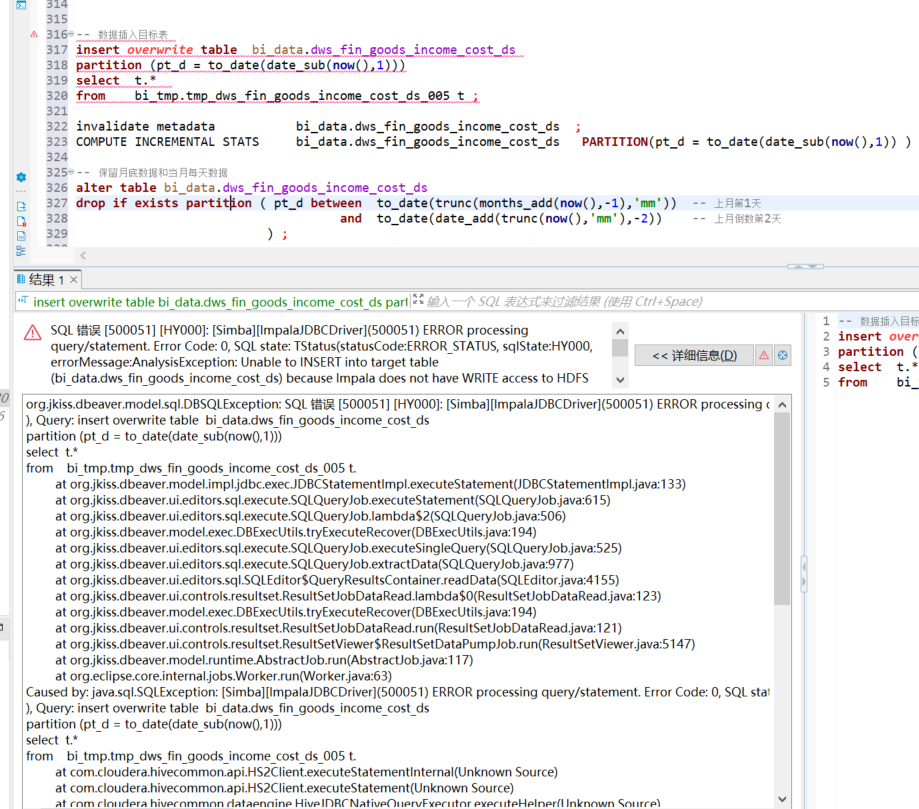

# Impala常见问题与解决

---

## Impala读写HDFS权限不够问题
- [问题现象]() </br>

```.text
select  t.*  
from    bi_tmp.tmp_dws_fin_goods_income_cost_ds_005 t.
	at org.jkiss.dbeaver.model.impl.jdbc.exec.JDBCStatementImpl.executeStatement(JDBCStatementImpl.java:133)
	at org.jkiss.dbeaver.ui.editors.sql.execute.SQLQueryJob.executeStatement(SQLQueryJob.java:615)
	at org.jkiss.dbeaver.ui.editors.sql.execute.SQLQueryJob.lambda$2(SQLQueryJob.java:506)
	at org.jkiss.dbeaver.model.exec.DBExecUtils.tryExecuteRecover(DBExecUtils.java:194)
	at org.jkiss.dbeaver.ui.editors.sql.execute.SQLQueryJob.executeSingleQuery(SQLQueryJob.java:525)
	at org.jkiss.dbeaver.ui.editors.sql.execute.SQLQueryJob.extractData(SQLQueryJob.java:977)
	at org.jkiss.dbeaver.ui.editors.sql.SQLEditor$QueryResultsContainer.readData(SQLEditor.java:4155)
	at org.jkiss.dbeaver.ui.controls.resultset.ResultSetJobDataRead.lambda$0(ResultSetJobDataRead.java:123)
	at org.jkiss.dbeaver.model.exec.DBExecUtils.tryExecuteRecover(DBExecUtils.java:194)
	at org.jkiss.dbeaver.ui.controls.resultset.ResultSetJobDataRead.run(ResultSetJobDataRead.java:121)
	at org.jkiss.dbeaver.ui.controls.resultset.ResultSetViewer$ResultSetDataPumpJob.run(ResultSetViewer.java:5147)
	at org.jkiss.dbeaver.model.runtime.AbstractJob.run(AbstractJob.java:117)
	at org.eclipse.core.internal.jobs.Worker.run(Worker.java:63)
Caused by: java.sql.SQLException: [Simba][ImpalaJDBCDriver](500051) ERROR processing query/statement. Error Code: 0, SQL state: TStatus(statusCode:ERROR_STATUS, sqlState:HY000, errorMessage:AnalysisException: Unable to INSERT into target table (bi_data.dws_fin_goods_income_cost_ds) because Impala does not have WRITE access to HDFS location: hdfs://nameservice1/user/hive/warehouse/bi_data.db/dws_fin_goods_income_cost_ds
), Query: insert overwrite table  bi_data.dws_fin_goods_income_cost_ds 
partition (pt_d = to_date(date_sub(now(),1)))
select  t.*  
from    bi_tmp.tmp_dws_fin_goods_income_cost_ds_005 t.
	at com.cloudera.hivecommon.api.HS2Client.executeStatementInternal(Unknown Source)
	at com.cloudera.hivecommon.api.HS2Client.executeStatement(Unknown Source)
	at com.cloudera.hivecommon.dataengine.HiveJDBCNativeQueryExecutor.executeHelper(Unknown Source)
	at com.cloudera.hivecommon.dataengine.HiveJDBCNativeQueryExecutor.execute(Unknown Source)
	at com.cloudera.jdbc.common.SStatement.executeNoParams(Unknown Source)
	at com.cloudera.jdbc.common.SStatement.execute(Unknown Source)
	at org.jkiss.dbeaver.model.impl.jdbc.exec.JDBCStatementImpl.execute(JDBCStatementImpl.java:330)
	at org.jkiss.dbeaver.model.impl.jdbc.exec.JDBCStatementImpl.executeStatement(JDBCStatementImpl.java:131)
	at org.jkiss.dbeaver.ui.editors.sql.execute.SQLQueryJob.executeStatement(SQLQueryJob.java:615)
	at org.jkiss.dbeaver.ui.editors.sql.execute.SQLQueryJob.lambda$2(SQLQueryJob.java:506)
	at org.jkiss.dbeaver.model.exec.DBExecUtils.tryExecuteRecover(DBExecUtils.java:194)
	at org.jkiss.dbeaver.ui.editors.sql.execute.SQLQueryJob.executeSingleQuery(SQLQueryJob.java:525)
	at org.jkiss.dbeaver.ui.editors.sql.execute.SQLQueryJob.extractData(SQLQueryJob.java:977)
	at org.jkiss.dbeaver.ui.editors.sql.SQLEditor$QueryResultsContainer.readData(SQLEditor.java:4155)
	at org.jkiss.dbeaver.ui.controls.resultset.ResultSetJobDataRead.lambda$0(ResultSetJobDataRead.java:123)
	at org.jkiss.dbeaver.model.exec.DBExecUtils.tryExecuteRecover(DBExecUtils.java:194)
	at org.jkiss.dbeaver.ui.controls.resultset.ResultSetJobDataRead.run(ResultSetJobDataRead.java:121)
	at org.jkiss.dbeaver.ui.controls.resultset.ResultSetViewer$ResultSetDataPumpJob.run(ResultSetViewer.java:5147)
	at org.jkiss.dbeaver.model.runtime.AbstractJob.run(AbstractJob.java:117)
Caused by: com.cloudera.support.exceptions.GeneralException: [Simba][ImpalaJDBCDriver](500051) ERROR processing query/statement.
 Error Code: 0, SQL state: TStatus(statusCode:ERROR_STATUS, sqlState:HY000, errorMessage:AnalysisException: 
 Unable to INSERT into target table (bi_data.dws_fin_goods_income_cost_ds)
 because Impala does not have WRITE access to HDFS location: hdfs://nameservice1/user/hive/warehouse/bi_data.db/dws_fin_goods_income_cost_ds
), Query: insert overwrite table  bi_data.dws_fin_goods_income_cost_ds 
partition (pt_d = to_date(date_sub(now(),1)))
select  t.*  
from    bi_tmp.tmp_dws_fin_goods_income_cost_ds_005 t.
	... 19 more
```
- [问题分析]() </br>
```.text
Impala读写HDFS权限不够,需要增加写入权限
```
- [问题解决]() </br>
```.text
执行赋权操作:
方式1：
hadoop fs -chmod -R 775 hdfs://10.53.0.71:8020/user/hive/warehouse/bi_data.db/dws_fin_goods_income_cost_ds
方式2：
hadoop fs -chmod 775 /user/hive/warehouse/bi_data.db/dwd_material_test_plan_detail_ds
invalidate metadata  bi_data.dwd_material_test_plan_detail_ds;    -- hdfs集群上更改数据库表权限之后，一定要记住登录到impala-shell上使用invaladate metadata命令进行元数据更新，否则更改的权限在impala状态下是不生效的！！！
方式3：
impala-shell -u root -f /root/bin/t_xiaoke/dwd_t_std_crumb_event_process/dwd_t_std_crumb_event_process.sql --var=execute_date="'2022-05-07'"
```


## 参考资料
- [impala没有write权限插入数据到hive表：impala does not have write access to at least on HDFS path hdfs://...](https://blog.csdn.net/lukabruce/article/details/84070025)