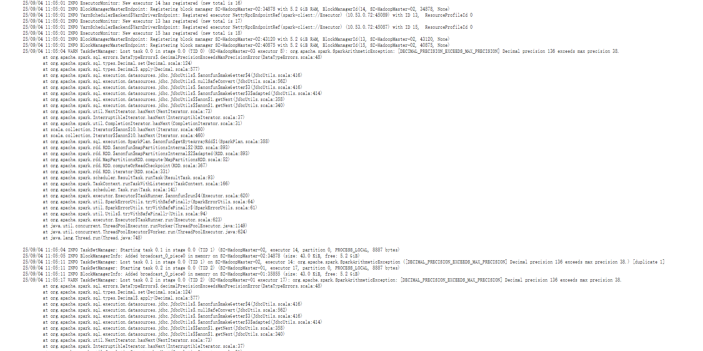
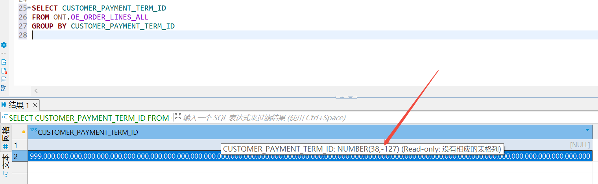

# Spark常见问题整理

---

## Q-1
- [报错现象]() </br>
- [负面影响]() </br>
```.text

```

- [原因分析]() </br>
```.text

```

- [解决步骤]() </br>
```.text

```

## Q-2
- [报错现象]() </br>

- [负面影响]() </br>
```.text
作业运行失败
```
- [原因分析]() </br>

```.text
由日志信息：org.apache.spark.SparkArithmeticException: [DECIMAL_PRECISION_EXCEEDS_MAX_PRECISION] Decimal precision 136 exceeds max precision 38
java.lang.ArithmeticException: Decimal precision 136 exceeds max precision 38
可知:
```

- [解决步骤]() </br>
```.text

```


## Q-3
- [报错现象]() </br>
- [负面影响]() </br>
```.text

```

- [原因分析]() </br>
```.text

```

- [解决步骤]() </br>
```.text

```


## 参考资料
- [SPARK-31404. You can set "spark.sql.parquet.int96RebaseModeInWrite" to "LEGACY" to rebase the datetime values w.r.t.报错](https://blog.csdn.net/2301_76509964/article/details/143177335)
- [通过参数调整解决Spark作业中的Decimal精度问题](https://baijiahao.baidu.com/s?id=1838007114479817151&wfr=spider&for=pc)