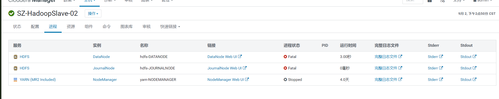
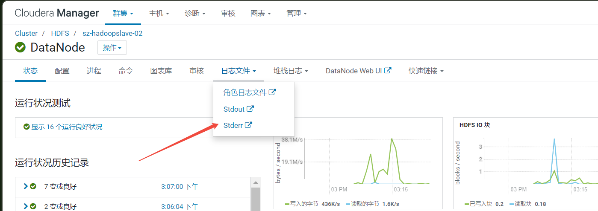
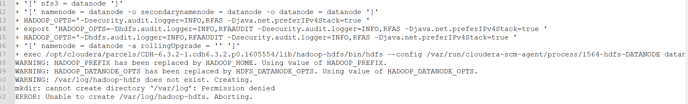
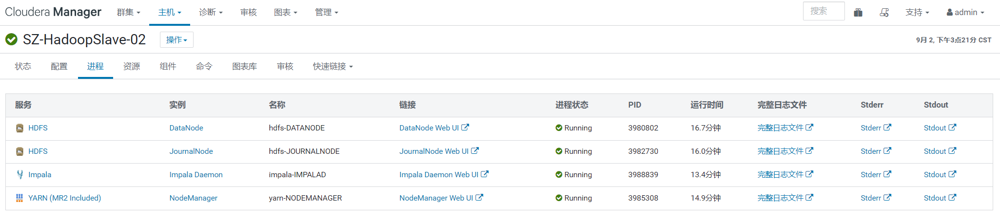

# CM常见问题整理

---

## Q-1
- [报错现象]() </br>
```.text
某个CM Agent节点上所有组件服务均无法重启
```
 </br>
- [负面影响]() </br>
```.text
导致CM集群上的组件服务节点无法正常运行
```
- [原因分析]() </br>
```.text
误删除/var/log/* 目录下所有日志；导致重启时日志目录缺少读写权限，从而报错；
```
 </br>
 </br>
- [解决步骤]() </br>
```.text
日志目录授予读写权限：
chmod -R 777 /var/log/
```
 </br>


## Q-2
- [报错现象]() </br>
```.text

```
- [负面影响]() </br>
```.text

```

- [原因分析]() </br>
```.text

```

- [解决步骤]() </br>
```.text

```


## Q-3
- [报错现象]() </br>
```.text

```
- [负面影响]() </br>
```.text

```

- [原因分析]() </br>
```.text

```

- [解决步骤]() </br>
```.text

```


