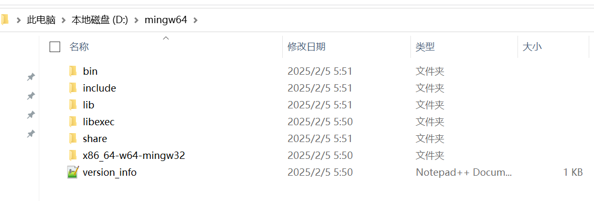

# C语言开发环境部署整理

---

## Windows
### 方式1
- [C编译器MinGW-W64 GCC安装]()
```.text
1.下载:C编译器MinGW-W64 GCC,并解压安装
2.
```
 </br>


## MacOS


## 参考资料
- [C编译器MinGW-W64 GCC](https://winlibs.com/#download-release)
- [Windows配置C语言环境(超级详细)](https://blog.csdn.net/hellow_xqs/article/details/135219180)