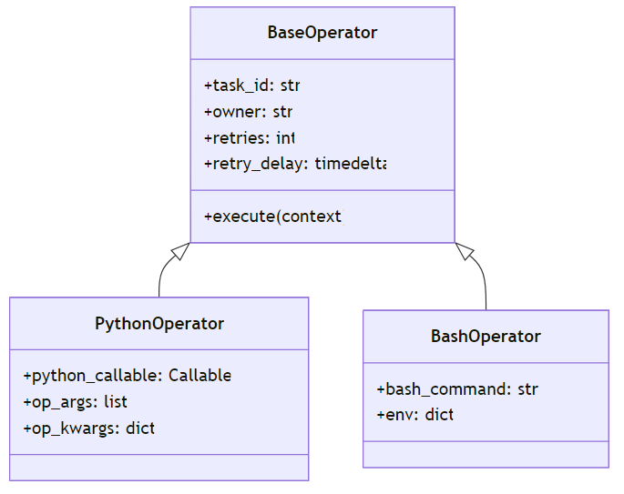
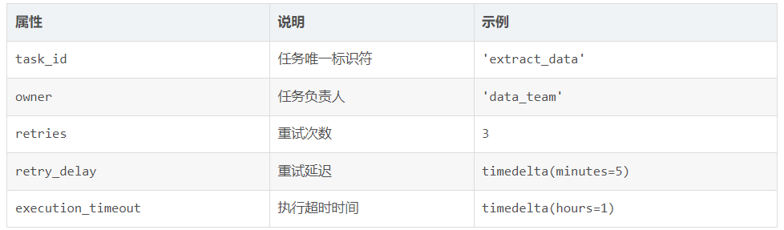
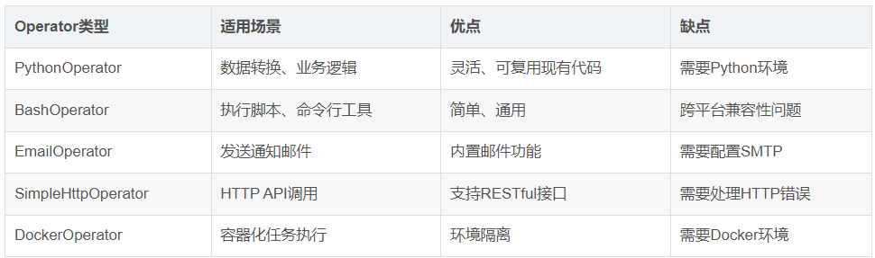

# Airflow Operator整理

## 什么是Operator
```.text
Operator是Airflow中定义单个任务工作逻辑的类。每个Operator都代表工作流中的一个具体操作，如执行Python函数、运行Bash命令、传输数据等
```
 </br>

## Operator的核心属性
```.text

```
 </br>

## 内置Operator详解
### PythonOperator
```.text
PythonOperator：灵活执行Python代码
PythonOperator是最常用的Operator之一，允许执行任意的Python函数。
```

### BashOperator
```.text

```

### BranchPythonOperator
```.text

```

### EmailOperator
```.text

```

### SimpleHttpOperator
```.text

```

### DockerOperator
```.text

```

### 自定义Operator
```.text

```

### 常用内置Operator对比
 </br>


### 参考资料
- [Apache Airflow Operators大全：内置与自定义操作器实战指南](https://blog.csdn.net/gitblog_00202/article/details/150953003)
- [Apache Airflow操作符大全：核心操作符深度解析](https://blog.csdn.net/gitblog_00556/article/details/150607037)


