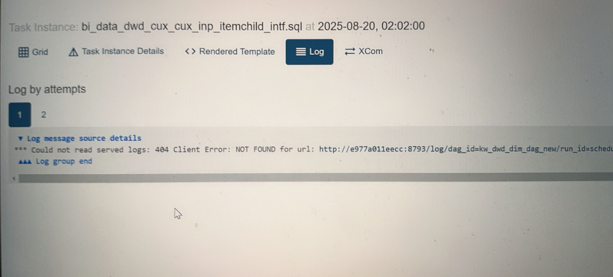
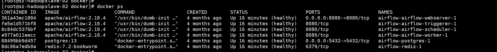

# Airflow常见问题整理

---

## Q-1
- [报错现象]() </br>
   </br>
- [负面影响]() </br>
```.text

```
- [原因分析]() </br>
  - 查看airflow安装服务器  </br>
   </br>
```.text

```

- [解决步骤]() </br>
```.text
docker exec -it 361a43ec1804 /bin/bash
vi /etc/hosts
```

## Q-2
- [报错现象]() </br>
- [负面影响]() </br>
```.text

```

- [原因分析]() </br>
```.text

```

- [解决步骤]() </br>
```.text

```


## Q-3
- [报错现象]() </br>
- [负面影响]() </br>
```.text

```

- [原因分析]() </br>
```.text

```

- [解决步骤]() </br>
```.text

```